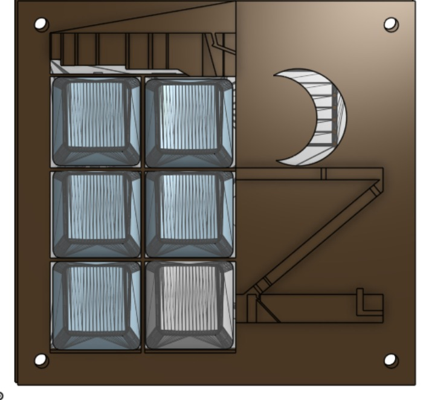
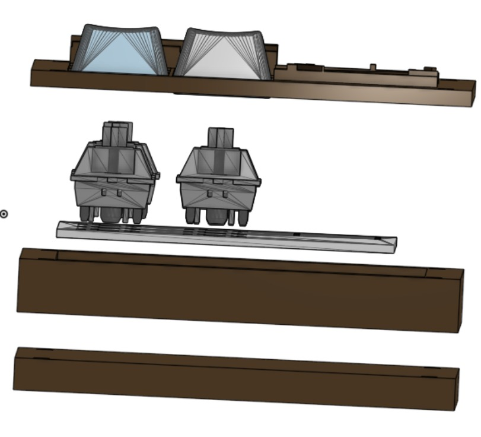

# Shrek--Outhouse-Macropad
The  Shrek's Outhouse Macropad is a 2x3 Macropad that looks like Shrek’s outhouse. It was made to make everyday tasks, such as switching tabs, easier. It is also designed to be used as a device that can be set to do anything, for example, starting a recording in OBS.

# Features
- 6 programmable keys
- USB-C support
- Modelled after Shrek’s outhouse with its features, such as the crescent moon 

# CAD Model
Everything fits together using X4 M3x18 Bolts and x4 M3 nuts

My CAD Model has 3 different 3D printable parts. After putting together the bottom and middle part you pust then insert the PCB and then wire all your components. Once that is finished, you can place the top cover.  This Macropad holds 6 differenrt programable keys. 

# PCB
Here is my PCB, it was made using Kicad!

### Schematic:

### PCB:

# Firmware Overview
QMK is used to generate the firmware and VIA is used to remap the keys without re-flashing the macropad. One the macropad is flashed with the VIA-enabled firmware, the macropad keymap can be changed using https://www.usevia.app/ in a CHROMIUM BASED browser (it will not work in non-chromium based browsers due to lack of WebHID support). With this website you can see what browsers are supported: https://caniuse.com/?search=webhid. The VIA desktop app can also be used.

### Features:

- VIA-enabled dynamic keymaps
- EEPROM-based configuration storage so that keymaps are remembered between powercycles
- Bootmagic support for resetting
- Compatible with VIA web app and VIA desktop app

# BOM
Here is everything you will need to make this macropad!

- X6 DSA Keycaps
- X6 Cherry MX Switches
- X4 M3x18 bolts
- X4 M3 nuts
- X1 RaspberryPI-Pico
  

